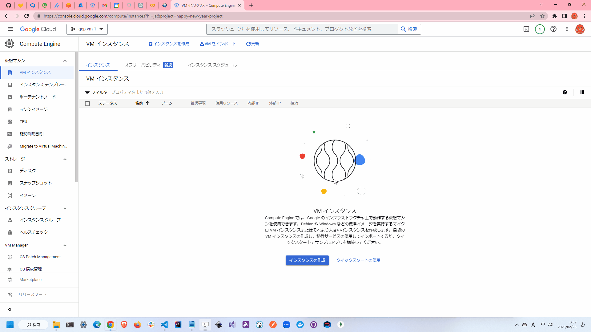

# simple-ComputeEngine.tf

🏵️🏵️🏵️ TerraformでGCP上に`Compute Engine`を立ち上げるサンプルです。  

  

## 環境情報

| Name | Version |
| ---- | ---- |
| terraform | v1.3.7 |
| Google Cloud SDK | 418.0.0 |

## 実行方法

`terraform.tfvars.example`をコピーして`terraform.tfvars`を作成し、適切な値を設定してください。  

```shell
terraform init
terraform plan
terraform apply
```

リソースを削除する場合は以下のコマンドを実行してください。  

```shell
terraform destroy
```

## その他イロイロ

ファイアウォールルールは以下の通りです。  

* インバウンド通信はSSH(22)・HTTP(80)・HTTPS(443)のみ許可
* SSHは自分のIPアドレスのみ許可
* アウトバウンド通信は全て許可

## 各種設定

### Terraform

[公式サイト](https://developer.hashicorp.com/terraform/downloads)にそって、Terraformをダウンロードしてください。  
インストール後は、以下のコマンドを実行して、Terraformのバージョンを確認してください。  

```shell
terraform version
```

正しくインストールされていない場合には、パスが通っていない可能性があります。  
パスが通っていない場合は、以下のコマンドを実行して、パスを通してください。  

```shell
# Windows
$env:PATH += ";C:/★パス★"

# Unix系
export PATH=$PATH:/★パス★
```

### GCPの設定

[プロジェクト セレクタに移動](https://console.cloud.google.com/projectselector2/home/dashboard?hl=ja)から、対象のプロジェクトを選択します。  

次に、[IAMページ](https://console.cloud.google.com/iam-admin/iam?hl=ja)から、以下の権限が付与されていることを確認してください。  

* compute.instance.*
* compute.firewalls.*

最後に[API を有効にする](https://console.cloud.google.com/flows/enableapi?apiid=compute.googleapis.com&hl=ja)から、`Compute Engine API`を有効にしてください。  

### gcloud CLI

[公式サイト](https://learn.microsoft.com/ja-jp/cli/azure/install-azure-cli)にそって、gcloud CLIをインストールしてください。  
Windowsユーザは以下のコマンドを実行すればOKです。  

```powershell
(New-Object Net.WebClient).DownloadFile("https://dl.google.com/dl/cloudsdk/channels/rapid/GoogleCloudSDKInstaller.exe", "$env:Temp\GoogleCloudSDKInstaller.exe") & $env:Temp\GoogleCloudSDKInstaller.exe
```

```shell
# ログイン
gcloud auth login

# プロジェクトの変更
gcloud config set project PROJECT_ID
```

## 参考文献

* [Google (Terraform)](https://cloud.google.com/docs/terraform?hl=ja)
